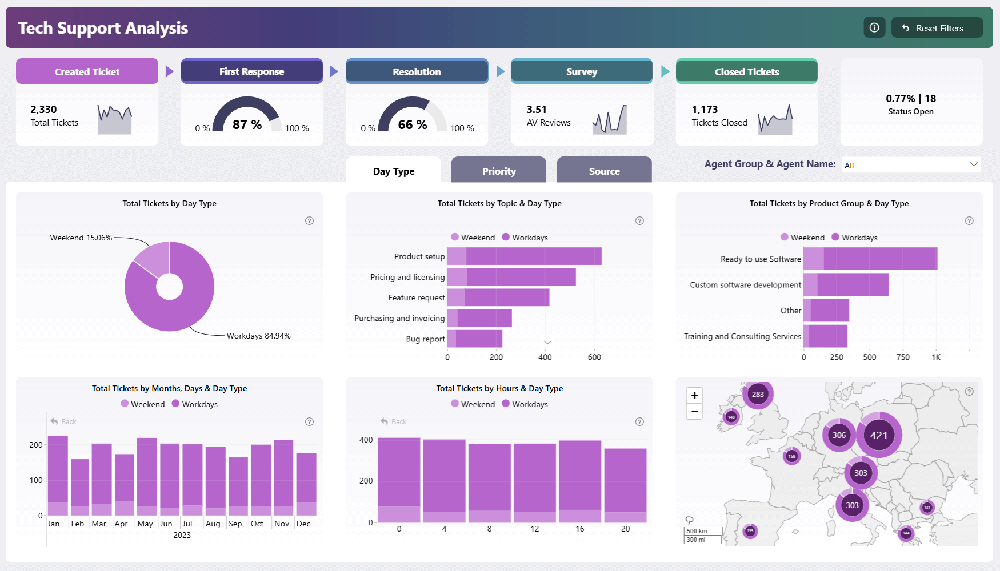

# Project Title
- description

## Objective:
- description

### Different phases:
- data collection
- data transformation and exploration
- analysis report

## Phase1: Data Collection:
- description

## Data Transformation and Exploration (EDA):
- description
- images of charts/visuals code
- 

## Analysis Report:
- conclusion/recommedantion/suggestion -  Analysis report
